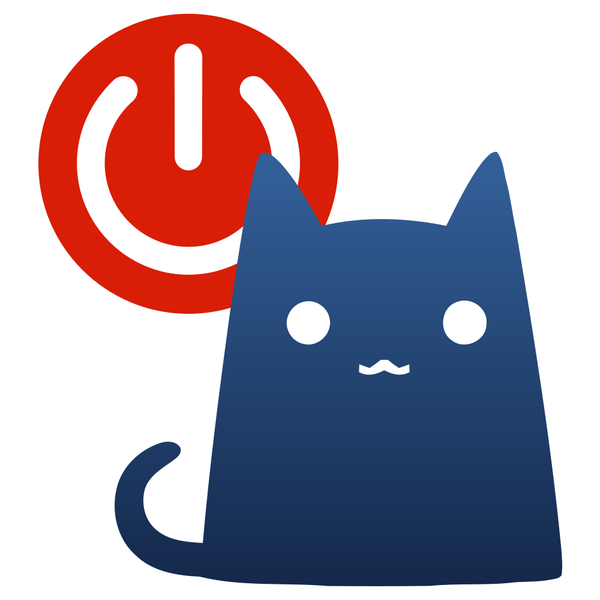


此文仅适用于客户端, 不适用于服务器和路由器。



`Clash Meta` 改名为 `mihomo`。


## Core

参考 [FAQ](https://wiki.metacubex.one/faq/faq/) 下载 [二进制文件](https://wiki.metacubex.one/startup/), 解压后将其重命名为 `mihomo.exe`。

## 配置文件

创建 mihomo 工作目录, 比如 `C:\Users\<UserName>\Apps\mihomo`。
放入配置文件 `config.yaml`。参考以下配置: 

```yaml
# 官方参考配置 https://github.com/MetaCubeX/mihomo/blob/Alpha/docs/config.yaml
# 官方配置详解 https://wiki.metacubex.one/config/

allow-lan: false
bind-address: '*'
mode: rule
log-level: error
ipv6: true
# 单位为秒
keep-alive-interval: 30
find-process-mode: always
external-controller: 127.0.0.1:9090
secret: AjIuQAZf795UQ16V3si6
external-ui: ui
external-ui-url: 'https://ghp.ci/https://github.com/MetaCubeX/metacubexd/archive/refs/heads/gh-pages.zip'
# external-ui-url: 'https://ghp.ci/https://github.com/MetaCubeX/Yacd-meta/archive/refs/heads/gh-pages.zip'
profile:
  store-selected: true
  store-fake-ip: true
unified-delay: true
tcp-concurrent: true
global-client-fingerprint: chrome
geodata-mode: true
geodata-loader: memconservative
geo-auto-update: true
# 单位为小时
geo-update-interval: 24
geox-url:
  geoip: 'https://ghp.ci/https://raw.githubusercontent.com/MetaCubeX/meta-rules-dat/release/geoip.dat'
  geosite: 'https://ghp.ci/https://raw.githubusercontent.com/MetaCubeX/meta-rules-dat/release/geosite.dat'
global-ua: clash.meta

dns:
  enable: true
  prefer-h3: false
  use-hosts: true
  respect-rules: false
  listen: 0.0.0.0:10053
  ipv6: true
  # 可选值 fake-ip / redir-host
  enhanced-mode: fake-ip
  fake-ip-range: 198.18.0.1/16
  fake-ip-filter: ['*.lan', 'stun.*.*.*', 'stun.*.*', time.windows.com, time.nist.gov, time.apple.com, time.asia.apple.com, '*.ntp.org.cn', '*.openwrt.pool.ntp.org', time1.cloud.tencent.com, time.ustc.edu.cn, pool.ntp.org, ntp.ubuntu.com, ntp.aliyun.com, ntp1.aliyun.com, ntp2.aliyun.com, ntp3.aliyun.com, ntp4.aliyun.com, ntp5.aliyun.com, ntp6.aliyun.com, ntp7.aliyun.com, time1.aliyun.com, time2.aliyun.com, time3.aliyun.com, time4.aliyun.com, time5.aliyun.com, time6.aliyun.com, time7.aliyun.com, '*.time.edu.cn', time1.apple.com, time2.apple.com, time3.apple.com, time4.apple.com, time5.apple.com, time6.apple.com, time7.apple.com, time1.google.com, time2.google.com, time3.google.com, time4.google.com, music.163.com, '*.music.163.com', '*.126.net', musicapi.taihe.com, music.taihe.com, songsearch.kugou.com, trackercdn.kugou.com, '*.kuwo.cn', api-jooxtt.sanook.com, api.joox.com, joox.com, y.qq.com, '*.y.qq.com', streamoc.music.tc.qq.com, mobileoc.music.tc.qq.com, isure.stream.qqmusic.qq.com, dl.stream.qqmusic.qq.com, aqqmusic.tc.qq.com, amobile.music.tc.qq.com, '*.xiami.com', '*.music.migu.cn', music.migu.cn, '*.msftconnecttest.com', '*.msftncsi.com', localhost.ptlogin2.qq.com, '*.*.*.srv.nintendo.net', '*.*.stun.playstation.net', 'xbox.*.*.microsoft.com', '*.ipv6.microsoft.com', '*.*.xboxlive.com', speedtest.cros.wr.pvp.net, ssh.github.com, altssh.gitlab.com]
  # 更多 DNS 参考: https://senzyo.net/2022-22/
  default-nameserver:
    - 'udp://223.6.6.6'
  nameserver-policy:
  # 为 proxy-provider 使用的域名指定 DNS 服务器, 不然无法下载订阅文件
    '+.pronetwork.top,+.wd-turbo.com': ['https://dns.alidns.com/dns-query']
    'geosite:geolocation-!cn': ['https://dns.google/dns-query#🚀 默认出站']
    'geosite:cn': ['https://dns.alidns.com/dns-query']
  nameserver:
    - 'https://dns.google/dns-query#🚀 默认出站'
  proxy-server-nameserver:
    - 'https://dns.alidns.com/dns-query'

sniffer:
  enable: false
  force-dns-mapping: true
  parse-pure-ip: false
  override-destination: false

mixed-port: 7890
tun:
  enable: true
  stack: mixed
  auto-route: true
  auto-detect-interface: true
  dns-hijack:
    - 'udp://any:53'
    - 'tcp://any:53'
  strict_route: true
  gso: false
  endpoint-independent-nat: false
  exclude-package:
    - 'com.android.captiveportallogin'

urltest: &urltest
  type: url-test
  disable-udp: false
  url: 'https://www.gstatic.com/generate_204'
  # 单位为秒, 仅影响 proxies 下的节点
  interval: 300
  # 单位为毫秒
  timeout: 2000
  # 单位为毫秒
  tolerance: 0
  lazy: false
  expected-status: 204
  use:
    - 'Provider1'

select1: &select1
  type: select
  disable-udp: false
  proxies:
    - '🚀 默认出站'
    - 'DIRECT'
    - '📌 单选节点'
    - '🇭🇰 香港节点'
    - '🇯🇵 日本节点'
    - '🇰🇷 韩国节点'
    - '🇹🇼 台湾节点'
    - '🇸🇬 新加坡节点'
    - '🇺🇸 美国节点'

proxy-groups:
  - name: '🚀 默认出站'
    type: select
    disable-udp: false
    proxies:
      - '🌏 日韩台新'
      - '📌 单选节点'
      - '🇭🇰 香港节点'
      - '🇯🇵 日本节点'
      - '🇰🇷 韩国节点'
      - '🇹🇼 台湾节点'
      - '🇸🇬 新加坡节点'
      - '🇺🇸 美国节点'
  - name: '🌏 日韩台新'
    filter: '🇯🇵|日本|JP|Japan|🇰🇷|韩国|KR|South Korea|🇹🇼|台湾|TW|Taiwan|🇸🇬|新加坡|SG|Singapore'
    <<: *urltest
  - name: '📌 单选节点'
    type: select
    disable-udp: false
    exclude-filter: '剩余|流量|raffic|有效|时间|到期|xpire|地址|网址|官网|自动|最优|最快'
    use:
      - 'Provider1'
  - name: '📢 广告'
    type: select
    disable-udp: false
    proxies:
      - 'REJECT'
      - '🚀 默认出站'
      - 'DIRECT'
      - '📌 单选节点'
      - '🇭🇰 香港节点'
      - '🇯🇵 日本节点'
      - '🇰🇷 韩国节点'
      - '🇹🇼 台湾节点'
      - '🇸🇬 新加坡节点'
      - '🇺🇸 美国节点'
  - name: '📥 Downloader'
    <<: *select1
  - name: '🍎 Apple'
    type: select
    disable-udp: false
    proxies:
      - 'DIRECT'
      - '🚀 默认出站'
      - '📌 单选节点'
      - '🇭🇰 香港节点'
      - '🇯🇵 日本节点'
      - '🇰🇷 韩国节点'
      - '🇹🇼 台湾节点'
      - '🇸🇬 新加坡节点'
      - '🇺🇸 美国节点'
  - name: '🎮 Game'
    <<: *select1
  - name: '🔎 Google'
    <<: *select1
  - name: '🥽 Meta'
    <<: *select1
  - name: '☁️ OneDrive'
    <<: *select1
  - name: '🤖 OpenAI'
    <<: *select1
  - name: '🪟 Microsoft'
    <<: *select1
  - name: '✈️ Telegram'
    <<: *select1
  - name: '🖥️ SSH'
    <<: *select1
  - name: '🇭🇰 香港节点'
    filter: '🇭🇰|香港|HK|Hong Kong'
    <<: *urltest
  - name: '🇯🇵 日本节点'
    filter: '🇯🇵|日本|JP|Japan'
    <<: *urltest
  - name: '🇰🇷 韩国节点'
    filter: '🇰🇷|韩国|KR|South Korea'
    <<: *urltest
  - name: '🇹🇼 台湾节点'
    filter: '🇹🇼|台湾|TW|Taiwan'
    <<: *urltest
  - name: '🇸🇬 新加坡节点'
    filter: '🇸🇬|新加坡|SG|Singapore'
    <<: *urltest
  - name: '🇺🇸 美国节点'
    filter: '🇺🇸|美国|US|USA|United States'
    <<: *urltest

rules:
  # 所有 geoip 和 geosite 类别参考:
  # https://github.com/Loyalsoldier/v2ray-rules-dat/issues/146#issuecomment-940664130
  # https://github.com/MetaCubeX/meta-rules-dat?tab=readme-ov-file#geositedatgeositedb-内容
  - GEOSITE,private,DIRECT
  - GEOIP,private,DIRECT,no-resolve
  - SUB-RULE,(PROCESS-NAME,ssh),ssh
  - SUB-RULE,(PROCESS-NAME,ssh.exe),ssh
  - SUB-RULE,(PROCESS-NAME,ssh-agent.exe),ssh
  - GEOSITE,category-ads-all,📢 广告
  - DOMAIN-SUFFIX,copymanga.site,🚀 默认出站
  - DOMAIN-SUFFIX,mangafuna.xyz,🚀 默认出站
  - DOMAIN-SUFFIX,mangafunb.fun,🚀 默认出站
  - DOMAIN-SUFFIX,senzyo.net,🚀 默认出站
  - SUB-RULE,(RULE-SET,downloader),downloader
  - GEOSITE,apple,🍎 Apple
  - GEOSITE,category-games@cn,DIRECT
  - GEOSITE,category-games,🎮 Game
  - GEOSITE,google,🔎 Google
  - GEOIP,google,🔎 Google,no-resolve
  - GEOSITE,meta,🥽 Meta
  - GEOIP,facebook,🥽 Meta,no-resolve
  - GEOSITE,onedrive,☁️ OneDrive
  - GEOSITE,openai,🤖 OpenAI
  - GEOSITE,microsoft,🪟 Microsoft
  - GEOSITE,telegram,✈️ Telegram
  - GEOIP,telegram,✈️ Telegram,no-resolve
  - GEOSITE,geolocation-!cn,🚀 默认出站
  - GEOSITE,cn,DIRECT
  - GEOIP,cn,DIRECT,no-resolve
  - MATCH,🚀 默认出站
sub-rules:
  downloader:
    - GEOSITE,cn,DIRECT
    - GEOIP,cn,DIRECT,no-resolve
    - MATCH,📥 Downloader
  ssh:
    - GEOSITE,cn,DIRECT
    - GEOIP,cn,DIRECT,no-resolve
    - MATCH,🖥️ SSH

proxy-providers:
  Provider1:
    type: http
    url: "https://example.com"
    path: ./proxy_providers/Provider1.yaml
    # 单位为秒
    interval: 86400
    proxy: DIRECT
    health-check:
      enable: true
      url: 'https://www.gstatic.com/generate_204'
      # 单位为秒, 仅影响 proxy-group 中 use 下的节点
      interval: 300
      # 单位为毫秒
      timeout: 2000
      lazy: false
      expected-status: 204
    override:
      udp: true
      up: '45 Mbps'
      down: '90 Mbps'

rule-providers:
  downloader:
    type: http
    url: 'https://ghp.ci/https://raw.githubusercontent.com/senzyo-desu/as-gist/master/Rule/Clash/downloader.yaml'
    path: ./rule-providers/downloader.yaml
    # 单位为秒
    interval: 86400
    behavior: classical
    format: yaml
```

## Dashboard

下载 [Yacd-meta](https://ghproxy.net/https://github.com/MetaCubeX/Yacd-meta/archive/refs/heads/gh-pages.zip) 或者 [MetaCubeXD](https://ghproxy.net/https://github.com/MetaCubeX/metacubexd/archive/refs/heads/gh-pages.zip), 解压后将文件夹重命名为 `ui`, 移动到 mihomo 工作目录下: `C:\Users\<UserName>\Apps\mihomo\ui`。

## 开机自启动

### 方案一: 任务计划程序

打开任务计划程序, 点击右侧操作列表中的“创建任务”:

1. 常规

    名称填 `mihomo`。
    `更改用户或组`, 输入 `system`, 点击 `检查名称` 按钮, 变为 <u>SYSTEM</u>, 即使用 `SYSTEM` 账户。

2. 触发器

    新建, `开始任务` 选择 `登录时` 或 `启动时`, 按需选择 `延迟任务时间`, 确认勾选 `已启用`。

3. 操作

    新建, `操作` 选择 `启动程序`; `程序或脚本` 填写 `mihomo.exe`; `添加参数` 填写 `-d .\ -f config.yaml`; `起始于` 填写 mihomo 工作目录, 比如 `C:\Users\<UserName>\Apps\mihomo`。

4. 条件

    全部取消勾选, 包括灰显的。

5. 设置

   1. 仅勾选 `允许按需运行任务`。
   2. 最下方的 `如果此任务已经运行, 以下规则适用`, 确认选择 `请勿启动新实例`。

### 方案二: Windows服务



利用 [winsw](https://github.com/winsw/winsw/releases) 安装 Windows 服务。

1. 将以下内容保存为 `mihomo service.xml`, 和 `winsw.exe` 一起放入 mihomo 工作目录中。

    ```xml
    <service>
        <startmode>Automatic</startmode>
        <id>mihomo service</id>
        <name>mihomo 服务</name>
        <description></description>
        <executable>mihomo.exe</executable>
        <arguments>-d .\ -f config.yaml</arguments>
        <log mode="none"></log>
    </service>
    ```

    注意, `<id>` 指 `Name`, `<name>` 指 `DisplayName`。更多 XML 设置参考 [文档](https://github.com/winsw/winsw/blob/v3.0.0-alpha.11/docs/xml-config-file.md)。

2. 在 mihomo 工作目录中运行以下命令将 `mihomo service` 安装为 Windows 服务: 

    ```shell
    winsw.exe install "mihomo service.xml"
    ```

3. 运行服务, 检查是否正常。



## 防火墙

防火墙入站规则放行 `mihomo.exe`。

## 禁用智能多宿主名称解析

1. 按下 `Win+S/Q`, 搜索并打开 `编辑组策略`。
2. 转到 `计算机配置`→`管理模板`→`网络`→`DNS 客户端`。
3. 找到 `禁用智能多宿主名称解析`, 启用它。


现在可以运行 `任务计划程序` 或 `Windows 服务` 测试一下整个流程, 应该一切正常。


## 脚本


这些脚本是为了方便日常使用的。设置好脚本的快捷方式后, 日常点一下就行。



以下脚本不适用于使用 [Windows 服务](#方案二-windows服务) 的方案。


### 当前模式重启

修改以下内容, 写入到脚本 `C:\Users\<UserName>\Apps\mihomo\Restart.ps1`:

```shell
$controller_api = "http://127.0.0.1:9090"
$api_secret = "AjIuQAZf795UQ16V3si6"
$process = "mihomo"
$task = "mihomo"
$proxy_port = 7890

Stop-Process -Name $process -Force > $null 2>&1
Clear-DnsClientCache
Start-ScheduledTask -TaskName $task
Start-Sleep -Seconds 3
$state = Get-ScheduledTask -TaskName $task | Select-Object -ExpandProperty State
Write-Host "State of ${task}: ${state}"
if ($state -eq "Running") {
    $proxyEnabled = (Get-ItemProperty -Path 'Registry::HKEY_CURRENT_USER\Software\Microsoft\Windows\CurrentVersion\Internet Settings').ProxyEnable
    if ($proxyEnabled -eq 0) {
        Write-Host "System proxy disabled."
        Write-Host "Use tun mode."
        Invoke-RestMethod -Headers @{ "Authorization" = "Bearer $api_secret" } -ContentType "application/json" -Method PATCH -Body '{"tun": {"enable": true}}' -Uri "$controller_api/configs"
        Write-Host "TUN enabled."
    } else {
        Set-ItemProperty -Path 'Registry::HKEY_CURRENT_USER\Software\Microsoft\Windows\CurrentVersion\Internet Settings' -Name ProxyServer -Value "127.0.0.1:$proxy_port"
        Set-ItemProperty -Path 'Registry::HKEY_CURRENT_USER\Software\Microsoft\Windows\CurrentVersion\Internet Settings' -Name ProxyEnable -Value 1
        Write-Host "System proxy enabled."
        Write-Host "Use system proxy mode."
        Invoke-RestMethod -Headers @{ "Authorization" = "Bearer $api_secret" } -ContentType "application/json" -Method PATCH -Body '{"tun": {"enable": false}}' -Uri "$controller_api/configs"
        Write-Host "TUN disabled."
    }
} else {
    Write-Host "Run ${task} failed."
}
Start-Sleep -Seconds 1
```

### 停止运行

修改以下内容, 写入到脚本 `C:\Users\<UserName>\Apps\mihomo\Stop.ps1`:

```shell
$process = "mihomo"

Set-ItemProperty -Path 'Registry::HKEY_CURRENT_USER\Software\Microsoft\Windows\CurrentVersion\Internet Settings' -Name ProxyEnable -Value 0
Write-Host "System proxy disabled."
Stop-Process -Name $process -Force > $null 2>&1
Write-Host "${process} stopped."
Clear-DnsClientCache
Start-Sleep -Seconds 1
```

### 切换模式重启

修改以下内容, 写入到脚本 `C:\Users\<UserName>\Apps\mihomo\Switch.ps1`:

```shell
$controller_api = "http://127.0.0.1:9090"
$api_secret = "AjIuQAZf795UQ16V3si6"
$process = "mihomo"
$task = "mihomo"
$proxy_port = 7890

$state = Get-ScheduledTask -TaskName $task | Select-Object -ExpandProperty State
Write-Host "State of ${task}: ${state}"
if ($state -ne "Running") {
    Stop-Process -Name $process -Force > $null 2>&1
    Clear-DnsClientCache
    Start-ScheduledTask -TaskName $task
    Start-Sleep -Seconds 3
    $state = Get-ScheduledTask -TaskName $task | Select-Object -ExpandProperty State
    Write-Host "State of ${task}: ${state}"
    if ($state -ne "Running") {
        Write-Host "Run ${task} failed."
        Start-Sleep -Seconds 2
        exit 1
    }
}
if ($state -eq "Running") {
    $proxyEnabled = (Get-ItemProperty -Path 'Registry::HKEY_CURRENT_USER\Software\Microsoft\Windows\CurrentVersion\Internet Settings').ProxyEnable
    if ($proxyEnabled -eq 0) {
        Set-ItemProperty -Path 'Registry::HKEY_CURRENT_USER\Software\Microsoft\Windows\CurrentVersion\Internet Settings' -Name ProxyServer -Value "127.0.0.1:$proxy_port"
        Set-ItemProperty -Path 'Registry::HKEY_CURRENT_USER\Software\Microsoft\Windows\CurrentVersion\Internet Settings' -Name ProxyEnable -Value 1
        Write-Host "System proxy enabled."
        Write-Host "Use system proxy mode."
        Invoke-RestMethod -Headers @{ "Authorization" = "Bearer $api_secret" } -ContentType "application/json" -Method PATCH -Body '{"tun": {"enable": false}}' -Uri "$controller_api/configs"
        Write-Host "TUN disabled."
    } else {
        Write-Host "System proxy disabled."
        Write-Host "Use tun mode."
        Invoke-RestMethod -Headers @{ "Authorization" = "Bearer $api_secret" } -ContentType "application/json" -Method PATCH -Body '{"tun": {"enable": true}}' -Uri "$controller_api/configs"
        Write-Host "TUN enabled."
    }
}
Start-Sleep -Seconds 1
```

### 更新并备份Core

由于 mihomo 的 [Alpha](https://github.com/MetaCubeX/mihomo/releases/tag/Prerelease-Alpha) 版本更新很快, 手动更新版本并备份到网盘也太麻烦了, 干脆用 PowerShell 脚本自动下载核心到 OneDrive 的文件夹中, 并覆盖 mihomo 工作目录中的旧版本可执行文件: 

```shell
$Releaseurl = "https://api.github.com/repos/MetaCubeX/mihomo/releases/tags/Prerelease-Alpha"
$Assets = Invoke-RestMethod -Uri $Releaseurl -Method Get
$AssetUrls = $Assets.assets | Where-Object { $_.name -like "mihomo-linux-amd64-alpha*gz" -or $_.name -like "mihomo-windows-amd64-alpha*zip" } | Select-Object -ExpandProperty browser_download_url
# 不要使用中文路径
$ClashWorkPath = "$env:USERPROFILE\Apps\mihomo"
$DefaultDownloadPath = "$env:USERPROFILE\Downloads"
$LinuxBackupPath = "$env:OneDriveCommercial\Software\Linux\mihomo"
$WindowsBackupPath = "$env:OneDriveCommercial\Software\Windows\mihomo"
$process = "mihomo"
$task = "mihomo"

Get-ChildItem -Path $LinuxBackupPath, $WindowsBackupPath -Recurse | Remove-Item
foreach ($Url in $AssetUrls) {
    $FileName = [System.IO.Path]::GetFileName($Url)
    if($FileName -like "*linux*"){
        $FilePath = "$LinuxBackupPath\$FileName"
    }elseif($FileName -like "*windows*"){
        $FilePath = "$WindowsBackupPath\$FileName"
    }else{
        $FilePath = "$DefaultDownloadPath\$FileName"
    }
    Write-Host "Downloading $Url"
    Invoke-WebRequest -OutFile "$FilePath" -Uri "https://ghproxy.net/$Url" -TimeoutSec 40
}

Stop-Process -Name $process -Force > $null 2>&1
Clear-DnsClientCache
Expand-Archive -LiteralPath "$WindowsBackupPath\$FileName" -DestinationPath "$ClashWorkPath" -Force
Set-Location -Path $ClashWorkPath
Rename-Item -Path "mihomo-windows-amd64.exe" -NewName "mihomo.exe"
Start-ScheduledTask -TaskName $task
Start-Sleep -Seconds 3
$state = Get-ScheduledTask -TaskName $task | Select-Object -ExpandProperty State
Write-Host "State of ${task}: ${state}"
if ($state -eq "Running") {
    Write-Host "${task} successfully started."
} else {
    Write-Host "Run ${task} failed."
}
Start-Sleep -Seconds 1
```

## 关于脚本

mihomo 的外部控制 API 支持开关 TUN 模式。

脚本的两个功能: 系统代理的开关是通过管理注册表实现的, TUN 模式的开关是通过 [PATCH](https://wiki.metacubex.one/api/#configs) 请求实现的。

### 权限

为 `.ps1` 文件 (PowerShell 脚本文件) 创建快捷方式, 然后右击文件, “属性→快捷方式→目标”, 在文件路径前添加 `powershell.exe -ExecutionPolicy Bypass -File`, 比如: 

```
powershell.exe -ExecutionPolicy Bypass -File "Stop.ps1"
```

然后点击“应用”。

此外, 因为管理任务计划程序和 Windows 服务需要管理员权限, 所以需要让 `.ps1` 文件以管理员身份运行: 在“属性→快捷方式→高级”中勾选“用管理员身份运行”。


```shell
# 检查是否以管理员权限运行脚本
if (! ([Security.Principal.WindowsPrincipal] [Security.Principal.WindowsIdentity]::GetCurrent()).IsInRole([Security.Principal.WindowsBuiltInRole] "Administrator")) {
    # 如果没有管理员权限, 则重新以管理员权限运行脚本
    Start-Process powershell -ArgumentList "-NoProfile -ExecutionPolicy Bypass -File `"$PSCommandPath`"" -Verb RunAs
    Exit
}
```


不要忘记设置脚本的权限, 让普通用户仅限读取和执行。

这样一路设置下来, 以后只需点击快捷方式即可。然后可以为快捷方式更换图标, 参见 [附件](#附件)。

### 不代理范围

脚本中可设置不代理的 IP 范围, 即 `localhost`, `127.*`, IP 私有地址和 `本地Intranet` 范围: 

```shell
Set-ItemProperty -Path 'Registry::HKEY_CURRENT_USER\Software\Microsoft\Windows\CurrentVersion\Internet Settings' -Name ProxyOverride -Value "localhost;127.*;10.*;172.16.*;172.17.*;172.18.*;172.19.*;172.20.*;172.21.*;172.22.*;172.23.*;172.24.*;172.25.*;172.26.*;172.27.*;172.28.*;172.29.*;172.30.*;172.31.*;192.168.*;<local>"
```

IP 私有地址范围: 

- A类地址范围: 10.0.0.0 ~ 10.255.255.255
- B类地址范围: 172.16.0.0 ~ 172.31.255.555
- C类地址范围: 192.168.0.0 ~ 192.168.255.255

## FAQ

### Core无法启动

如果不能启动, 请尝试更换版本, 版本选择参考 [FAQ](https://wiki.metacubex.one/faq/faq/)。

### 多个Core正在运行

在 MetaCubeXD 中点击了“重启核心”和“更新核心”按钮, 这时 mihomo 会重启, mihomo 的任务计划程序或者 Windows 服务转为就绪状态, 如果这时再手动启动 mihomo 的任务计划程序或者 Windows 服务, 就会有两个 mihomo 进程并存。

本文脚本中有重启 mihomo 的任务计划程序或者 Windows 服务的操作, 所以 MetaCubeXD 搭配本文脚本使用不会出现此问题。

### PowerShell脚本无法运行

参考微软官方文档 [Set-ExecutionPolicy](https://learn.microsoft.com/zh-cn/powershell/module/microsoft.powershell.security/set-executionpolicy), 以管理员身份运行 PowerShell, 执行以下命令: 

```shell
Set-ExecutionPolicy -ExecutionPolicy RemoteSigned -Scope LocalMachine
```

### UWP不走代理

部分应用没有启用本地网络回环功能, 特别是 UWP 应用, 默认是关闭网络回环的。使用 [AppContainer Loopback Exemption Utility](https://www.telerik.com/fiddler/add-ons) 来开启这些应用的本地网络回环功能, 使其流量经由系统代理。

## 附件

几个用于脚本快捷方式的自制图标:

<table>
  <tr>
    <td align="center"></td>
    <td align="center"></td>
    <td align="center"></td>
    <td align="center"></td>
  </tr>
</table>
